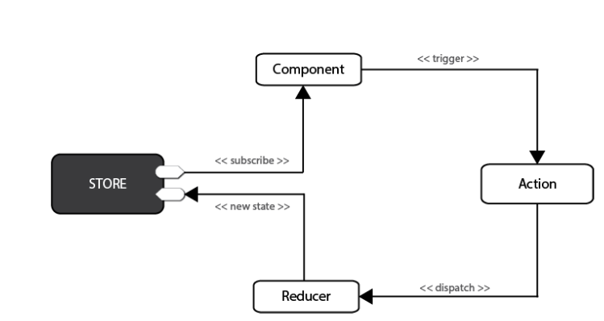

# REDUX

### State
* State refers to the single state value that is managed by the store and returned by getState(). 
* It represents the entire state of a Redux application, which is often a deeply nested object.

### Action
* An action is a plain object that represents an intention to change the state. 
* Actions are the only way to get data into the store. 
* Any data needs to eventually be dispatched as actions.
* Actions must have a `type` field that indicates the type of action being performed. 

### Dispatching Function
* Dispatch is a function of type: (a: Action) => Action
* The base dispatch function always synchronously sends an action to the store's reducer, along with the previous state returned by the store

### Reducer
* Reducer is a function of type: (state: S, action: A) => S
* A reducer (also called a reducing function) is a function that accepts an accumulation and a value and returns a new accumulation. 
* They are used to reduce a collection of values down to a single value.
* In Redux, the accumulated value is the state object, and the values being accumulated are actions. 
* Reducers calculate a new state given the previous state and an action. 

### Store
* A store is an object that holds the application's state tree abd dispatch functions
* There should only be a single store in a Redux app

## Simple redux flow
